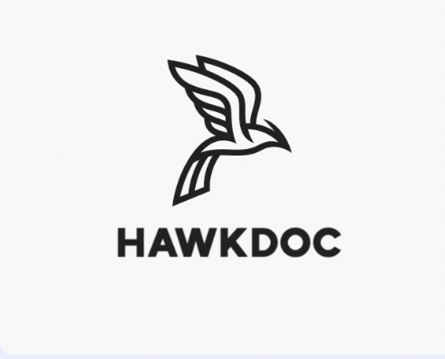
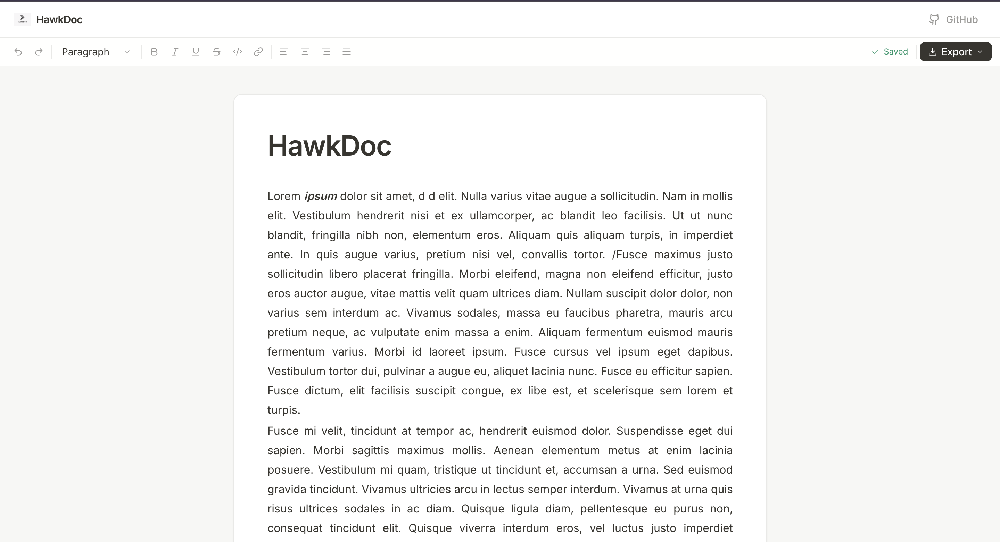

<p align="center">
  
</p>

<h1 align="center">HawkDoc</h1>

<p align="center">
  A high-performance, open-source document editor built on Lexical.
</p>

<p align="center">
  <a href="https://github.com/hawk-doc/hawkdoc/actions/workflows/ci.yml"></a>
  <a href="https://opensource.org/licenses/MIT"></a>
</p>

> ⚠️ HawkDoc is currently in MVP stage. Feedback and contributions are welcome.

---

## Screenshot

<p align="center">
  
</p>

> UI is actively being improved. This is the current MVP version.

---

## Overview

HawkDoc is a document editor focused on performance and template rendering. It is built on [Lexical](https://lexical.dev) — Meta's editor framework — and designed to handle large documents, dynamic template variables, and document export without blocking the UI.

The project is currently **MVP stage**. The core editor is functional. The collaboration layer, auth, and DOCX pipeline are planned.

---

## Features

- Lexical editor with block types: H1, H2, H3, paragraph, bullet list, ordered list, code block, quote, divider
- Slash `/` command menu with keyboard navigation
- Formatting toolbar: Bold, Italic, Underline, Strikethrough, inline code, link
- Floating bubble menu on text selection
- Template variable injection — type `{{variable_name}}` to insert a styled placeholder chip
- PDF export with watermark (via the Export menu in the toolbar)
- Markdown and HTML export
- Auto-save with 800ms debounce
- Editable document title
- Code block with copy-to-clipboard

---

## Quick Start

```bash
git clone https://github.com/hawk-doc/hawkdoc.git
cd hawkdoc

# Start PostgreSQL and Redis
docker compose up -d

# Install and run
npm install
npm run dev
```

Frontend: `http://localhost:5173` - API: `http://localhost:3001`

Copy `.env.example` to `.env` in both `apps/web` and `apps/api` and fill in the values before starting.

---

## Tech Stack

| Layer | Technology |
|---|---|
| Frontend | React 18, TypeScript, Tailwind CSS v3, Vite |
| Editor | Lexical (Meta) |
| Collaboration | Yjs + Hocuspocus |
| PDF Export | @react-pdf/renderer |
| Backend | Node.js 20, Express, TypeScript |
| Database | PostgreSQL 16 |
| Cache | Redis 7 |
| Auth | JWT |
| Validation | Zod |

---

## Project Status

| Area | Status |
|---|---|
| Editor (Lexical) | Working |
| PDF export | Working |
| Markdown export | Working |
| HTML export | Working |
| Template variables | Working |
| Auto-save (localStorage) | Working |
| Backend API (Express) | Skeleton |
| Real-time collaboration (Yjs) | Planned |
| DOCX import/export | Planned |
| Auth (JWT) | Skeleton |

The UI is intentionally minimal at this stage. Design improvements will come later.

---

## Roadmap

- [ ] Real-time collaboration (Hocuspocus + Yjs)
- [ ] User auth (JWT)
- [ ] Document list and workspace
- [ ] DOCX import/export
- [ ] Version history
- [ ] Image upload support

---

## Contributing

Contributions are welcome. Please read [CONTRIBUTING.md](CONTRIBUTING.md) before opening a PR.

- All PRs target the `dev` branch
- Follow [Conventional Commits](https://www.conventionalcommits.org)
- Look for [`good first issue`](https://github.com/hawk-doc/hawkdoc/issues?q=label%3A%22good+first+issue%22) labels to get started

---

## License

MIT © HawkDoc Contributors
